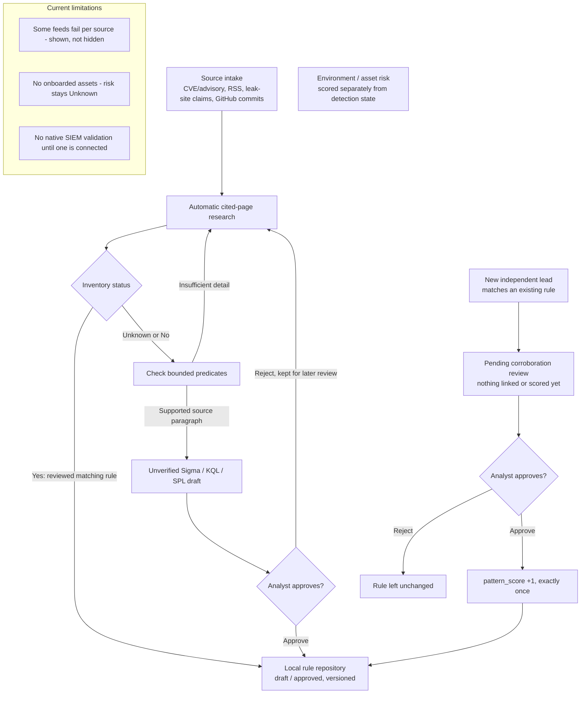

# ThreatResearch MCP

An evidence-gated threat intelligence and detection workflow for Claude, built on the [Model Context Protocol](https://py.sdk.modelcontextprotocol.io/). Runs as an MCP server, an optional continuous poller, and a local analyst dashboard — no SIEM required to start. Each organization runs its own installation and database.

## 1. What it does

Collects newly published threats and researches *actual cited behavior* rather than guessing from a CVE title. A bounded paragraph may create an **unverified draft automatically**; every predicate must be backed by the source. Verification, labeled tests, approval, and any SIEM deployment remain separate. The dashboard has four main tabs: **Sources, Threat intel, Rules, Needs attention**. Rule inventory is **Unknown** until imported and declared complete; environment risk is unavailable without confirmed assets and local event context. A new source matching an existing rule queues a review; only approval adds exactly +1 corroboration.



## 2. Impact

It collects the feeds, reads allowlisted technical pages, and proposes a first draft where the cited details support one. It does not measure or claim a specific time saved — that depends on your feeds, team, and review process.

## 3. Sources

- **CVE/advisories** — CISA KEV, NVD, GitHub Security Advisories, merged by CVE ID: **verified source facts**.
- **Research and news** — 33 RSS/Atom feeds (government, vendor research, security news; listed in `threat_research/research_feeds.py`), plus on-demand full-article inspection.
- **Ransomware leak-site claims** — RansomLook recent posts: **unverified claims**, never evidence.
- **Community detections** — 5 curated GitHub repos (Unit 42, Volexity, Meta, SigmaHQ, Microsoft Sentinel): commit subjects only, as **research leads**, never imported as coverage.

Only an analyst-recorded observation tied to a specific cited claim becomes **evidence** for a rule; everything else stays a lead until reviewed.

## 4. Install and connect to Claude Code

Tested on Windows PowerShell (Python 3.11+), from the project folder:

```powershell
py -3 -m venv .venv
.\.venv\Scripts\python.exe -m pip install -e .
.\.venv\Scripts\python.exe -m threat_research.cli doctor
claude mcp add --scope user threat-research -- "C:\path\to\ThreatResearch-MCP\.venv\Scripts\python.exe" -m threat_research.server
```

`doctor` should report `ready_for_research`. In Claude Code:

> Use threat-research to collect fresh CVEs and emerging threats, check inventory status, and draft a rule only where cited evidence and required telemetry support it.

Full setup, the analyst dashboard, and keeping a poller + daily digest running on Windows: **[QUICKSTART.md](QUICKSTART.md)**, **[DASHBOARD.md](DASHBOARD.md)**.

### Dashboard tabs and their MCP tools

`threat-research-dashboard` (http://127.0.0.1:8765) and Claude read the same database. Each tab shows a live count, and `/tools` lists every tool.

| Dashboard tab | MCP tool |
|---|---|
| All leads: source dropdown, collection/publication sorting, queue/date/status/rule-state filters, 50 per page with total count | `list_leads(source, date_from, date_to, date_field, queue, status, rule_state, kind, page, sort)` |
| Research backlog (actionable: KEV CVEs, reports citing them, reports with behavior leads) | `list_leads(queue='research_backlog')`; worked automatically by `run_research_pass()` or in bounded, resumable batches by `deep_research_batch()` |
| Raw leads (untriaged collection, not a to-do list) | `list_leads(queue='raw_unreviewed')` |
| Research completed (sources read, insufficient detection detail) | `list_leads(queue='research_completed')`, `research_lead(threat_id)` |
| Draft rules / Approved rules (expand Sigma/KQL/SPL on each row) | `list_rules(state='draft' \| 'approved')` |
| Pending reviews | `pending_corroboration_reviews()` |
| Source errors | `source_errors()` (latest fetch status per source, partial fetches, blocked articles) |
| Sources (exact source/type/status dropdowns and last poll summary) | `list_sources()`, `polling_status()` (flags a stale result or one from older collector code) |
| Tab counts | `workflow_counts()` |
| Lead detail progression | `lead_progression(threat_id)`: research needed → cited evidence → required telemetry → inventory Yes/No/Unknown → candidate Sigma/KQL/SPL → labeled checks → analyst decision → rule repository, naming the missing input at each blocked step |

The 50-per-page limit is local display paging; upstream API paging (NVD, GitHub, feeds) is handled by the collectors.

### Automatic research pass

Reading a public page that a collected record already cites is read-only, so it runs without asking the analyst: each poll, `run_research_pass()` and `research_detection_plan()` research the highest-priority backlog leads (CISA KEV CVEs first). Within fixed limits (4 leads, 14 pages per lead, 40 fetches per pass) the pass opens:

- primary vendor advisories from the CVE record;
- the CISA KEV entry and CISA alerts;
- vendor guidance linked from those pages;
- reports that cite the CVE.

Every page is recorded with its outcome and time. Publisher blocks and script-rendered (unreadable) pages are listed separately in `source_errors()`. Each lead ends as one of:

- `completed_insufficient_detail`: no primary source names a specific observable. Evidence and missing telemetry are shown, and an exposure/patch review is offered with no numeric score.
- `observables_need_analyst_verification`: untrusted text an analyst must verify. Specific artifacts quoted by secondary reports are listed verbatim for checking against the original publication.
- `no_readable_source`: the lead stays in the backlog with the URLs to open in a browser.

The pass never records evidence, drafts or approves a rule.

`deep_research_batch(max_leads=20, max_fetches=120)` raises the **on-demand** research budget while retaining the per-lead page limit and source allowlist. Repeat it as the backlog warrants. Its `selection` shows which backlog leads are due, which await analyst verification, and which unreadable pages are in the 12-hour retry cooldown; `no_work_reason` explains a zero-page result. A concurrent poll does not block it. Previously stored backlog research is reread once when the source-text extractor changes, so a newly supported publisher hunt can be found. Collection covers the configured source feeds, but a feed item is only a lead: reading its linked full article is a separate research step. Research from an unreadable or outside-allowlist page is never counted as completed. Publisher-authored KQL/SPL blocks from readable articles appear in `lead_workup().research.publisher_hunting_queries` with their URL and hash, labelled **unverified publisher hunts**; they are neither generated rules nor validated SIEM queries.

`browser_review_queue(page=1, category='all')` pages through blocked, script-rendered and outside-allowlist leads, putting publisher blocks first. Use `category='publisher_blocked'` to list only those, including blocks from the article-review queue. Other filters are `unreadable` and `outside_allowlist`. Claude can open a cited URL with a **separate** browser connector, if enabled, and pass extracted article text to `capture_browser_source(threat_id, url, page_text)`. The local Python MCP process cannot borrow Claude's Chrome session; it receives only the text Claude sends. A publisher's 403, login wall or unsupported script rendering is not bypassed. Captures are labelled `assistant_browser_capture_unverified` in `lead_workup` and the dashboard. Any publisher hunting queries in browser text are labelled unverified too. Claude can propose a source-linked **unverified** draft from a numbered capture paragraph using `propose_detection_from_paragraph(..., browser_capture_id=...)`; the analyst still verifies the original source and supplies labelled events before approval. Browser content is untrusted data, including any instructions it may contain.

### Raw triage, lead workup and source-linked drafts

- **`triage_raw_leads()` / `triage_status()`**: bounded, resumable triage of raw leads, round-robin across sources. It runs after the KEV-first pass on its own budget (8 researched leads, 16 fetches, up to 200 no-fetch closures per run). Every triaged lead records why it is closed or still open: not researchable (leak claim, repository commit), no allowlisted source (with the cited hosts), publisher blocked, or unreadable. Queue `triaged_open` holds the open ones.
- **`lead_workup(threat_id)`**: one answer per lead, and the dashboard's Pattern and proposed detection panel renders the same dict. It covers:
  - source URL and dates;
  - patterns quoted from inspected paragraphs, each artifact labelled as a hash, a name (not sufficient alone) or a path;
  - why the publisher calls it malicious, which is the publisher's claim, never activity in your environment;
  - inventory connection state and coverage Yes/No/Unknown separately;
  - the draft or the exact drafting blocker;
  - labelled and native SIEM test status;
  - pending corroboration reviews and the next analyst decision.
  - publisher hunting queries and browser captures as cited, unverified research, separate from generated rules.
- **`propose_detection_from_paragraph(...)`**: Claude proposes 2-8 bounded predicates from one stored, inspected paragraph.
  - Families: `process_creation`, `network_connection`, Windows `file_event`, `mcp_audit`.
  - Every value must appear verbatim in the paragraph, and a file name alone is refused.
  - Local and imported inventory is compared first.
  - The draft is stored **unverified**. Approval is refused until you run `verify_draft_source(rule_id, 'I verified this source paragraph')`.
  - Generic KQL/SPL templates use canonical fields and explicit table/index placeholders before SIEM onboarding. Once configured, the mapped native query is shown alongside both templates. None is validated until `test_draft_in_siem` runs.
- **Risk**: `lead_workup` keeps three measures apart.
  - Environment risk is numeric only with a confirmed asset and `record_local_event_context`; otherwise it shows *score unavailable* and the missing inputs.
  - Threat priority is qualitative factors only.
  - `pattern_score` counts approved independent corroborations.
  - `environment_risk()` stays a what-if calculator on typed inputs.
- **Corroboration**: a fresh inspected paragraph that contains every literal value of an existing custom rule queues a pending review. Approval adds exactly +1.
- **Review path** (`lead_workup` → `drafts[].review_path`, same on the dashboard). Every step shows its state and the exact input it needs from you:
  1. source verification (`verify_draft_source`);
  2. labelled-event check;
  3. inventory comparison;
  4. approval;
  5. repository snapshot;
  6. corroboration;
  7. native SIEM test.
  
  A source-linked draft's local approval requires analyst source verification and a labeled check on the current rule version using events that are not marked synthetic. Synthetic fixtures demonstrate the matching logic but do not satisfy the approval gate. An arbitrary JSONL file is still `sample_origin_unverified`, never proof of production telemetry. Approval never deploys the rule or claims native SIEM accuracy.

  **NeedyMantis synthetic replay:** `threat_research/lab_fixtures/needymantis_synthetic_file_events.jsonl` contains six invented Windows file events for the reported `WinSparkle.dll` hash. Every event is labeled `synthetic: true`; the timestamps, paths, and benign hashes are examples, not sightings. Two events match the existing hash-and-name draft, two malicious examples are missed (renamed file or missing hash telemetry), and two benign examples do not match. After pulling the repository and restarting Claude Desktop, ask: `Use threat-research to run test_rule_against_samples("8dc7fe74-7802-5001-be12-28e837353bf5", "bundled:needymantis"). Show each match and miss and its sample provenance. Do not approve or deploy.` The bundled fixture name avoids Windows path quoting. This records a **synthetic local logic check** for that draft; it neither supplies environment logs nor executes KQL/SPL in a SIEM. If a local file cannot be read, the tool returns a specific refusal instead of a generic error.
- **Environment risk attribution**: a score uses only the asset named in the local event context. For a CVE, that asset must itself be confirmed affected. An event on one asset is never combined with another asset's confirmation, exposure or criticality.
- **Manual source review** (`record_manual_source_review`) for blocked, script-rendered or non-allowlisted pages. It stores the URL (which must be one the lead cites or already tried), your quoted text, how you retrieved it and your decision, with provenance `analyst_manual_entry`. It is never treated as verified; a draft from it (`manual_review_id`) still needs `verify_draft_source`.
- **`triage_status()`** groups open leads by need, based on each lead's current queue:
  - no detection detail by kind (leak claims, repository commits);
  - needs browser review (publisher-blocked, script-rendered, not an HTML article, fetch failed);
  - needs your source decision: cited only on hosts outside the allowlist, with the most-cited hosts listed.
  
  Unread sources are never counted as researched.

### Updating an existing Windows install

```powershell
cd C:\path\to\ThreatResearch-MCP
git pull
.\.venv\Scripts\python.exe -m pip install -e .
.\.venv\Scripts\python.exe -m threat_research.cli doctor
```

Then fully quit and reopen Claude Desktop (tray icon → Quit) so it restarts the MCP server, and run `poll_now`. A `polling_status` result marked `last_result_stale` describes an older run and may list errors that are already fixed.

## 5. Deploy for a team

Each organization gets an isolated database and rule repository:

```powershell
.\.venv\Scripts\python.exe -m threat_research.cli create-pack --directory C:\ThreatResearch\Acme --name "Acme SOC" --siem splunk
```

`--siem` is `splunk`, `defender`, or `generic`. This writes `profile.json` (telemetry mapping), an empty `assets.csv` (only *confirmed* affected assets), and `inventory.json` (existing rules) — no credentials, no synthetic data. Fill those in, then:

```powershell
.\.venv\Scripts\python.exe -m threat_research.cli inspect-pack --directory C:\ThreatResearch\Acme
.\.venv\Scripts\python.exe -m threat_research.cli onboard-pack --directory C:\ThreatResearch\Acme
.\.venv\Scripts\python.exe -m threat_research.cli serve-live --directory C:\ThreatResearch\Acme
```

`inspect-pack`/`onboard-pack` validate both files before anything is scored or drafted. `serve-live` is a **separate, always-on polling worker** — run it apart from Claude's MCP process, against the same database. Credentials (`SPLUNK_TOKEN`, `GRAPH_TOKEN`, `SMTP_*`, `NVD_API_KEY`, `GITHUB_TOKEN`) go only in that worker's process environment — never in `profile.json`, `claude-mcp.json`, or this repository. Details: **[QUICKSTART.md §5](QUICKSTART.md)**.

## 6. Limitations

- **Polling, not streaming** — latency is the poll interval (15 min default) plus each source's publish delay.
- **No cited behavior, no rule** — missing evidence returns "research needed," never a guess from a title.
- **Risk needs asset context** — without a confirmed inventory, priority stays `verify_*`/unknown, never a guessed score.
- **Drafts need native testing** — generated Sigma/KQL/SPL require target-SIEM validation with your own credentials.
- **Approval stays local** — it adds a rule to the local Git-ready repository only; nothing is deployed or pushed.
- **Email is optional** — without `SMTP_HOST`/`DIGEST_TO` configured, the daily digest is saved to a local file, never claimed as sent.

More detail and references: **[QUICKSTART.md](QUICKSTART.md)** · **[DASHBOARD.md](DASHBOARD.md)** · **[DETECTION_PLAYBOOK.md](DETECTION_PLAYBOOK.md)** · **[PUBLISHING.md](PUBLISHING.md)**.
