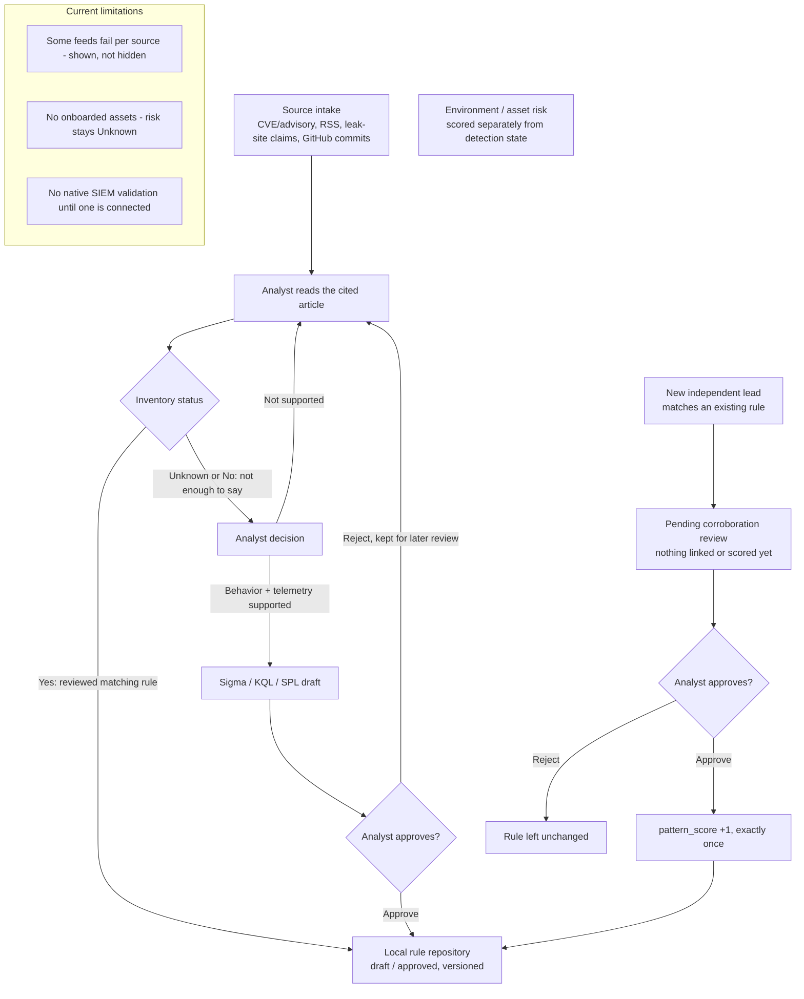

# ThreatResearch MCP

An evidence-gated threat intelligence and detection workflow for Claude, built on the [Model Context Protocol](https://py.sdk.modelcontextprotocol.io/). Runs as an MCP server, an optional continuous poller, and a local analyst dashboard — no SIEM required to start. Each organization runs its own installation and database.

## 1. What it does

Collects newly published threats, has Claude (or an analyst) research the *actual cited behavior* rather than guessing from a CVE title, checks whether matching coverage already exists (**Yes/No/Unknown**, never a guess), drafts a Sigma/KQL/SPL rule only when a behavior and its telemetry are verified, and adds that draft to a local rule repository only after explicit analyst approval — never automatically, never deployed to a SIEM. A newly collected lead that matches an *existing* rule queues a pending **corroboration review** instead of scoring anything by itself; only approval adds exactly +1.



## 2. Impact

It removes the manual work of checking dozens of feeds each morning, reading past a headline for real technical detail, and hand-drafting a first-pass Sigma rule with its telemetry list. It does not measure or claim a specific time saved — that depends on your feeds, team, and review process.

## 3. Sources

- **CVE/advisories** — CISA KEV, NVD, GitHub Security Advisories, merged by CVE ID: **verified source facts**.
- **Research and news** — 33 RSS/Atom feeds (government, vendor research, security news; listed in `threat_research/research_feeds.py`), plus on-demand full-article inspection.
- **Ransomware leak-site claims** — RansomLook recent posts: **unverified claims**, never evidence.
- **Community detections** — 5 curated GitHub repos (Unit 42, Volexity, Meta, SigmaHQ, Microsoft Sentinel): commit subjects only, as **research leads**, never imported as coverage.

Only an analyst-recorded observation tied to a specific cited claim becomes **evidence** for a rule; everything else stays a lead until reviewed.

## 4. Install and connect to Claude Code

Tested on Windows PowerShell (Python 3.11+), from the project folder:

```powershell
py -3 -m venv .venv
.\.venv\Scripts\python.exe -m pip install -e .
.\.venv\Scripts\python.exe -m threat_research.cli doctor
claude mcp add --scope user threat-research -- "C:\path\to\ThreatResearch-MCP\.venv\Scripts\python.exe" -m threat_research.server
```

`doctor` should report `ready_for_research`. In Claude Code:

> Use threat-research to collect fresh CVEs and emerging threats, check inventory status, and draft a rule only where cited evidence and required telemetry support it.

Full setup, the analyst dashboard, and keeping a poller + daily digest running on Windows: **[QUICKSTART.md](QUICKSTART.md)**, **[DASHBOARD.md](DASHBOARD.md)**.

### Dashboard tabs and their MCP tools

`threat-research-dashboard` (http://127.0.0.1:8765) and Claude read the same database. Each tab shows a live count, and `/tools` lists every tool.

| Dashboard tab | MCP tool |
|---|---|
| All leads: source dropdown, queue/date/status/rule-state filters, 50 per page with total count | `list_leads(source, date_from, date_to, date_field, queue, status, rule_state, kind, page)` |
| Research backlog (actionable: KEV CVEs, reports citing them, reports with behavior leads) | `list_leads(queue='research_backlog')`; worked automatically by `run_research_pass()` |
| Raw leads (untriaged collection, not a to-do list) | `list_leads(queue='raw_unreviewed')` |
| Research completed (sources read, insufficient detection detail) | `list_leads(queue='research_completed')`, `research_lead(threat_id)` |
| Draft rules / Approved rules | `list_rules(state='draft' \| 'approved')` |
| Pending reviews | `pending_corroboration_reviews()` |
| Source errors | `source_errors()` (latest fetch status per source, partial fetches, blocked articles) |
| Sources | `list_sources()`, `polling_status()` (flags a stale result or one from older collector code) |
| Tab counts | `workflow_counts()` |
| Lead detail progression | `lead_progression(threat_id)`: research needed → cited evidence → required telemetry → inventory Yes/No/Unknown → candidate Sigma/KQL/SPL → labeled checks → analyst decision → rule repository, naming the missing input at each blocked step |

The 50-per-page limit is local display paging; upstream API paging (NVD, GitHub, feeds) is handled by the collectors.

### Automatic research pass

Reading a public page that a collected record already cites is read-only, so it runs without asking the analyst: each poll, `run_research_pass()` and `research_detection_plan()` research the highest-priority backlog leads (CISA KEV CVEs first). Within fixed limits (4 leads, 14 pages per lead, 40 fetches per pass) the pass opens:

- primary vendor advisories from the CVE record;
- the CISA KEV entry and CISA alerts;
- vendor guidance linked from those pages;
- reports that cite the CVE.

Every page is recorded with its outcome and time. Publisher blocks and script-rendered (unreadable) pages are listed separately in `source_errors()`. Each lead ends as one of:

- `completed_insufficient_detail`: no primary source names a specific observable. Evidence and missing telemetry are shown, and an exposure/patch review is offered with no numeric score.
- `observables_need_analyst_verification`: untrusted text an analyst must verify. Specific artifacts quoted by secondary reports are listed verbatim for checking against the original publication.
- `no_readable_source`: the lead stays in the backlog with the URLs to open in a browser.

The pass never records evidence, drafts or approves a rule.

### Updating an existing Windows install

```powershell
cd C:\path\to\ThreatResearch-MCP
git pull
.\.venv\Scripts\python.exe -m pip install -e .
.\.venv\Scripts\python.exe -m threat_research.cli doctor
```

Then fully quit and reopen Claude Desktop (tray icon → Quit) so it restarts the MCP server, and run `poll_now`. A `polling_status` result marked `last_result_stale` describes an older run and may list errors that are already fixed.

## 5. Deploy for a team

Each organization gets an isolated database and rule repository:

```powershell
.\.venv\Scripts\python.exe -m threat_research.cli create-pack --directory C:\ThreatResearch\Acme --name "Acme SOC" --siem splunk
```

`--siem` is `splunk`, `defender`, or `generic`. This writes `profile.json` (telemetry mapping), an empty `assets.csv` (only *confirmed* affected assets), and `inventory.json` (existing rules) — no credentials, no synthetic data. Fill those in, then:

```powershell
.\.venv\Scripts\python.exe -m threat_research.cli inspect-pack --directory C:\ThreatResearch\Acme
.\.venv\Scripts\python.exe -m threat_research.cli onboard-pack --directory C:\ThreatResearch\Acme
.\.venv\Scripts\python.exe -m threat_research.cli serve-live --directory C:\ThreatResearch\Acme
```

`inspect-pack`/`onboard-pack` validate both files before anything is scored or drafted. `serve-live` is a **separate, always-on polling worker** — run it apart from Claude's MCP process, against the same database. Credentials (`SPLUNK_TOKEN`, `GRAPH_TOKEN`, `SMTP_*`, `NVD_API_KEY`, `GITHUB_TOKEN`) go only in that worker's process environment — never in `profile.json`, `claude-mcp.json`, or this repository. Details: **[QUICKSTART.md §5](QUICKSTART.md)**.

## 6. Limitations

- **Polling, not streaming** — latency is the poll interval (15 min default) plus each source's publish delay.
- **No cited behavior, no rule** — missing evidence returns "research needed," never a guess from a title.
- **Risk needs asset context** — without a confirmed inventory, priority stays `verify_*`/unknown, never a guessed score.
- **Drafts need native testing** — generated Sigma/KQL/SPL require target-SIEM validation with your own credentials.
- **Approval stays local** — it adds a rule to the local Git-ready repository only; nothing is deployed or pushed.
- **Email is optional** — without `SMTP_HOST`/`DIGEST_TO` configured, the daily digest is saved to a local file, never claimed as sent.

More detail and references: **[QUICKSTART.md](QUICKSTART.md)** · **[DASHBOARD.md](DASHBOARD.md)** · **[PUBLISHING.md](PUBLISHING.md)**.
